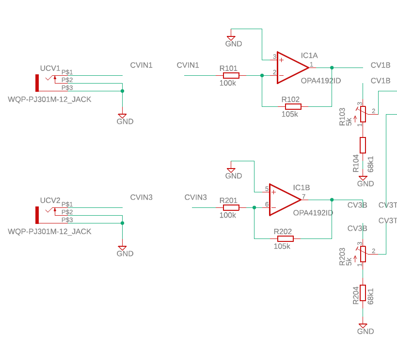
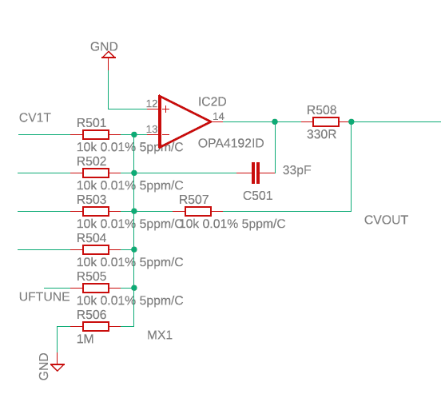
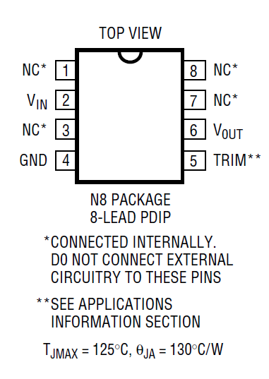
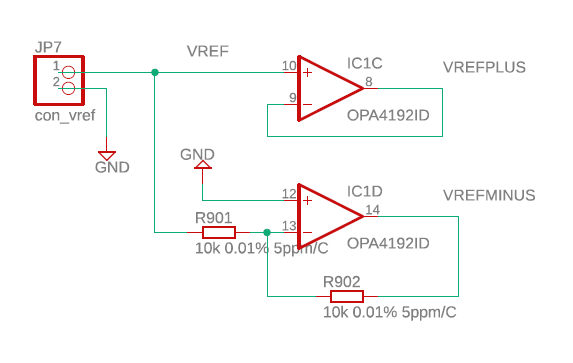
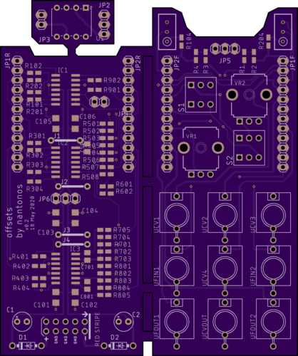
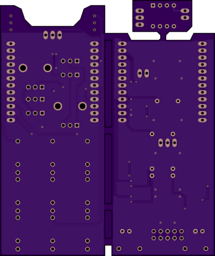
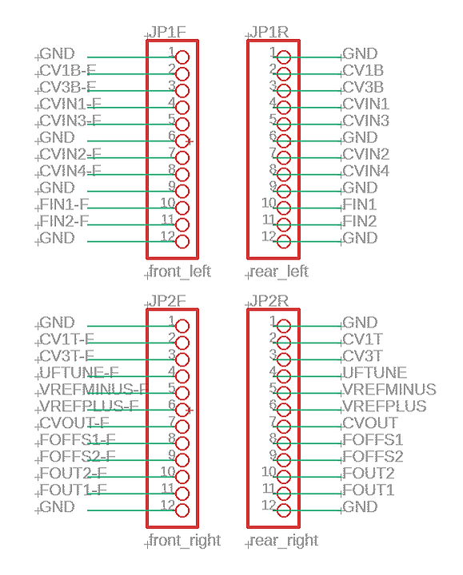
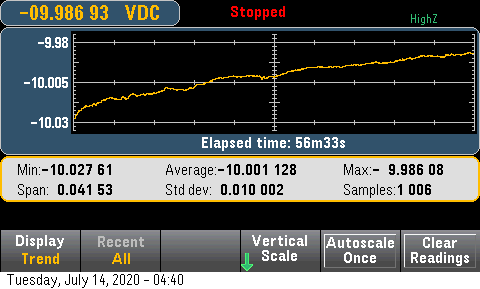

# offsets Eurorack module

## Purpose

_This module is a precision adder for pitch CV signals. The design aims for the highest precision possible; pitch deviation should be less than 15 cents cumulative over 10 octaves. An ultrafine tune is also provided. The output is low impedance, allowing it to drive an unbuffered mult._

_Also, two outputs are provided which track the main pitch CV but are offset from it. These are primarily intended for driving the pitch input on keyboard-tracking filters._

## Inputs and Outputs

Two pitch CV inputs with trimmable 1V/oct gain, for sources with a 1k output resistance.

Two untrimmed pitch CV inputs, for sources with low output resistance.

Variable small offset (ultrafine tune). ~~Switch to null ultrafine tune, for easy zero offset~~ (just unplug the pot, for setup).

Pitch CV output (sum of inputs and ultrafine offset).

Two sets of pitch CV, with additional offsets and external CV in, for filters.

8HP (40mm).

## General design

See also [detailed bill of materials](BOM.md)

### Vref buffer

One non-inverting unity and one inverting unity for + and - Vref = **2** op-amps.

### Input gain

#### Trimmed inputs

These are for CV sources with ill-advised 1k output resistors and the like. Inverting 1.07x 100k input gain stage (2, one per input) = **2** opamps. Voltage divider with trimmer and resistor to bring down to 1V/oct. 7% was from Dave Jones buffered mult design.

However ±7% adjustment range is too much. 1k output impedance into 4-way passive mult into 4 100k inputs (1k out to 25k in) is -3.8% drop, requiring a 4% compensating boost. Mostly, errors will be a drop not an increase. So an adjustment range of +5% to -2% seems better. Implies an input gain of 105% (use 100k and 105k resistors). With a 5k trimmer, 98 * 5 / 7 = 70k resistor to ground.

E96 value is 69.8k. However Mouser doesn't carry it (min order 5k, non-stocked) but they do have 68.1k. With a 5k trimmer, range is +5% to  105 * 68.1 / ( 68.1 + 5 ) = 97.818 = -2%.

Tempco of trimmer dominates the gain error on the two trimmed inputs.

#### Untrimmed inputs

These are for CV sources which are correctly designed and can drive with a low output impedance. And so we use 10k input because the available tolerance is better for 10k (0.02%, 5ppm) than for 100k (0.05%, 10ppm) and adding a trimmer would increase the tempco ppm.

Inverting 1.0x 10k input gain stage = **2** op-amps.

### Mixers

#### Main pitch CV mixer

One inverting mixer for inputs one to four plus ultrafine offset. Mixer is also the output stage = 1 op-amp.

Compensation cap 33pF, resistor 330R + 10k,
f = 1 / ( 2 * PI * 330 * 3.3E-11 ) = 14,614,778 14 Mhz way too high!!

Compensation cap 33pF, resistor 47R,
f = 1 / ( 2 * PI * 3.3E-11 * 47 ) = 102,614,405

Compensation cap 33pF, resistor 1k,
f = 1 / ( 2 * PI * 3.3E-11 * 1,000 ) = 4,822,877
1 / ( 2 * PI * 3.3E-11 * 11,000 ) = 438,443 403kHz ok

Cap should have been much larger

#### Offset mixers

Two inverting mixers for the two offset stages (pitch CV, ext input). BUT output from the first mixing stage needs to be inverted first = 3 more op-amps. And Ext CV also, = **6** in total op-amps.

### Output stages

None, just straight to the jacks. Single output jacks, can use passive mut if more needed.

## Vref

Use a 6-pin vref board connector for flexibility. +12V, -12V, 5V force, 5V sense, 0v force, 0V sense? Non-kelvin Vrefs can just tie the force and sense together. Allows anything from a cheapo vref to an LM399 board. Or just use a simple Vref, 0V connection which is sufficient here; stability more important than absolute value. Can still tie the gnd connection to the load, per *Standard Series Mode* figure. May also help to add thermal insulation to prevent turbulent air flow.

### LTLT1236-5

[LT1236ACN8-5](https://www.mouser.com/ProductDetail/Analog-Devices/LT1236ACN8-5PBF) **$7.96/1** A grade tempco 2 ppm/°C, initial accuracy 2.5mV, drift 20ppm/1kHr. But see datasheet fig.G08 _Output Voltage Temperature Drift LT1236-5_

Probably good enough in this appplication, but vref socket allows upgrading if needed.

DIP package. For precise 5V trim, also needs 27k, 50k trimmer, 1N4148 or similar diode. Not clear that is especially valuable in this application. Maybe add footprints on PCB, but allow to be used unpopulated.

10k load (from inverting buffer) means 0.5mA current is sourced, which is optimal (see datasheet, figure LT1236 G13).

### Vref usage

Inverting plus non-inverting buffers give +5V -5V. Apply across two pots for variable offset voltage. Or is 5V too much? Maybe 3V? No, Ondes needs up to 5 octave shift for filtering. Typical synth with resonant filter can use a smaller range. *(Maybe allow some unpopulated resistive dividers by the two pots to allow a smaller range like ±2V?)*

Voltage divider to ultrafine multiturn pot, plus larger resistor in input mixer gives +50 to -50mV ultrafine trim (±60 cents, or 12 cents per turn; experiment to find useful value). 0.5% is fine due to the tempco and adjustability of the multiturn pot,
but 10ppm helps stability.

## Op-amps

OPA4172ID ±200μV (typ) ±1mV (max @ 25°C) ±1.15mV (max over 40°C to +125°C) offset. 240millicent (typ) 1.3cent (max over temp). **$2.84/10**

OPA4197ID  ±25μV (typ) ±100μV (max @ 25°C)  120millicent (max @ 25°C ) **$3.39/10** (IDR version)

OPA4192ID ±5μV (typ) ±25μV (max @ 25°C) ±50μV (max over 0 to 70°C) offset, low offset drift (±0.2 µV/°C, typ). quad, good price/perf tradeoff (**$6.25/10**).

all in SOIC-14 package. 1.27mm (1/20 inch) pin spacing, so easy to hand solder. Needs 12 opamps = 3 quad packages.

Compare to ±50mV ultrafine tune = ±60cent tuning range = 12cent/turn = 33millicent per degree of turn. So 1.3cents offset means 36 degrees of tuning adjustment.

## Resistors

Balance of quality (tolerance, drift) and cost. Avoid quad packs, as they are only pairwise matched. Go for single low tempco 0.1% or better resistors and do any additional matching (the two untrimmed CV inputs vs. the mixer gain resistor is the critical point). 0805 size for ease of hand soldering.

Place gain trimmers just below ultrafine pot, PC mount.

- 28 of 100k 0.1% 5ppm/C

2.07 * 28 = $57.96

OR (better)

- 10 of 100k 0.1% 10ppm/C
- 18 of 10k 0.01% 5ppm/C

0.753 * 25 + 2.6 * 25 = $83.825

OR (even better)

- 6 of 100k 0.1% 10ppm/C (for the trimmed cv and the frequency offset inputs)
- 4 of 100k 0.05% 10ppm/C (for the two untrimmed CV inputs)
- 2 of 100k 0.05% 10ppm/C (for the ultrafine tune dividers)
- 2 of 1k 0.05% 10ppm/C (for the ultrafine tune dividers)
- 18 of 10k 0.01% 5ppm/C

0.753 * 25 + 1.06 * 5 + 2.6 * 25 = $89.125

and also

- 2 of 105k 1% or better 10ppm/C or better
- 2 of 70k  1% or better 10ppm/C or better (but check tempco of trimmer)
- 3 of 330R 1%  20ppm/C
- 1 of 1M any tolerance (ensuring 0V output with unconnected but patched inputs)
- ~~2 of 10R through-hole any tolerance (power lines)~~

### close tolerance

Close tolerance 0805 0.1% or better resistors.

Assuming the input and feedback resistors are close together and similar in terms of temperature and airflow, closer absolute matching is more important. Susumu 5ppm is available (RG2012V), but only up to 10k.

Better, make the mixers 10k, while keeping input resistors 100k. Would then be 10 110k input resistors (and the ones for CV2 and CV4 need to be well matched, at least) plus 18 very close tolerance 10k.

#### ~~Vishay TNPU0805100KBZEN00~~

0.1% 100k, 5ppm/C  0.1%/8kHr  $2.50/1 **$2.07/25** No, too expensive for the quality.

#### Susumu RG2012N-104-W-T1

0.05% 100k, 10ppm/C   $1.06/1 **$0.753/25** Good for the untrimmed input stages.

worse tempco than the Vishay, but closer tolerance and cheaper.

#### Susumu RG2012V-103-P-T1

0.02% 10k, 5ppm/C $3.66/1 $2.64/10 **$2.60/25**

2.5 times better tolerance for 3 times the price. A reasonable balance between tolerance/tempco and price.  Good for the precision mixers. Max value is 10k.

URG2012L-103-L-T05 available in 10k (0.01% 2ppm) but $12.32/1! Also RG2012L-103-L-T05 0.01% 2ppm/C but $5.96/1 $4.29/10. Neither available in 100k.

### Other value resistors

#### Susumu RG2012N-1053-D-T5

105k 0805

0.5% 10ppm/C $0.77/1 $0.66/10

which is ample given it is in series with a trimmer with 100ppm/C

or

#### Susumu ~~RG2012N-1053-W-T1~~

105k 0805

0.05% 10ppm/C  not available at Mouser, and marked obsolete

#### Susumu ~~RG2012N-6982-D-T5~~

69.8k 0805

*Non stocked!! Min 5000!!*

#### Susumu RG2012N-6812-D-T5

68.1k 0805

0.5% 10ppm/C $0.77/1 $0.66/10

Only 0.5%, but used with a trimmer.

#### Susumu RR1220P-331-D

330R 0805

0.5% 25ppm/C  $0.10/1 $0.085/10

#### Susumu RR1220P-105-D

1M 0805

0.5% (not needed, but whatever) $0.10/1

## Trimmers

### Bourns 3296W-1-502LF

5k 25 turn cermet 10% (!!) ±100ppm/C (!!!) these are the usual ones I have used before. $3.66/1 $2.86/10. LF is the RoHS lead-free type (and is less expensive).

### Bourns 3296W-LTC-502

5k 25 turn 10% ±20ppm/C $6.48/500 **non-stocked at Mouser, min 500**

### Vishay Y40535K00000K0L

5k 21 turn bulk foil 10% ±25ppm/C $29.45/1

Same footprint as Bourns 3296 so could be retrofitted if needed. Check height and screw position for panel hole line-up though. Very expensive.

### Vishay Y50515K00000J0L

5k 25 turn bulk metal foil 5% ±10ppm/C (end to end) ±25 ppm/C (through the wiper). Annoying end-screw, would need a different way to mount at 90 degrees. $21.72/1 $20.75/10 so very expensive.

### Bourns 50k

(for LT1236 trim, if used, but not needed or slightly detrimental (tempco made worse) here)

## Ultrafine control

10-turn Vishay [534B1104JC](https://www.mouser.com/ProductDetail/Vishay-Spectrol/534B1104JC) or Bourns [3590S-4-104L](https://www.mouser.com/ProductDetail/Bourns/3590S-4-104L) panel-mount wirewound or (preferably) plastic/hybrid 100k pot for ultrafine. Probably makes the panel 6HP rather than 4. However Mouser seems to have only wirewound in single-unit quantities; hybriton is MOQ 25.

### Bourns 3590S-4-104L  10-turn pot

-4 means sealed, metal bushing, metal shaft, solder lug connectors. $22.03/1.

2.46 to 3.81mm panel, so needs a washer.

10.44  ± .07mm mounting hole. 6.34mm ( (.2497 inch + .0000, - .0009) shaft

22.22mm ± .38 (.875 inch ±.015) diameter = 4.37HP so needs 5 or 6HP. Free panel mounted with wire connections, not PCB.

Tempco ±50 ppm/°C, but ratiometric, so should not matter.

### Vishay 534B1104JC

$25.17/1.

20 ppm/°C is better than the Bourns, but likely does not matter.

0.875 inch (22.22mm) diameter.

## Offset controls

For the offsets, perhas a regular alpha pot plus a dpdt switch (like C&K [7201SYCQE](https://www.mouser.com/ProductDetail/CK/7201SYCQE) or from [Thonk](https://www.thonk.co.uk/shop/sub-mini-toggle-switches/)) to go between positive and negative polarity? **check** eagle has a dpdt from multicomp as the standard switch, check the footprint, pin spacing, size of panel cutout.

8.13 x 9.14mm size.
0.2" (5.08mm) x 0.1" (2.54mm) pin spacing

Unspecified tempco of the Thonk Alpha pot (but ratiometric, so does not matter).

Thonkikon jacks at the bottom of the panel.

### Alpha pots

- VERTICAL: B10K - 10K Linear Alpha pots, Thonk £1.42/1

6.35mm shaft diameter. M7 bushing. 7.2mm hole.

### DPDT switches

- DW4 - DPDT ON-OFF-ON, Thonk £1.33/1

10-48 UNS2 bushing, whatever weird imperial shit that means. Specifies 4.95mm hole (without tolerances), use 5.00mm.

## Capacitors

### PSU Electrolytic

25V 22uF Nichicon etc electrolytic.

### Ceramic decoupling

Many types, C0G or X7R preferred. 25V 100nF 1206.

- Vishay VJ1206Y104KXXMP  $0.123/50
- Kemet C1206C104K3GEC7210  $0.051/100

### Feedback loop

25V 33pF 0805

- Kemet C0805C330J3GACTU C0G $0.125/10

## Panel

Large multiturn pot at top of panel, panel mount not PCB.

Below that, tucked in the corners, two front-accessible PCB mount gain trimmers.

~~Switch to enable/disable ultrafine?~~ Dropped, no room.

Pot for filter1 plus polarity switch.

Polarity switch for filter2 plus pot.

Jacks:

| PCV1 | PCV2 | PCV3 |
|--|--|--|
| Fin1 | PCV4 | Fin2 |
| Fout1 | Pitch | Fout2 |

### Panel dimensions

PCB plus multiturn pot is 110.49mm tall.
128.5 -110.49 = 18.01 /2 = 9mm (0.35") for top and bottom for rails, mounting holes.

Panel 40mm wide, so center at 20mm. Jacks at 0.5" spacing so 7.3mm, 20mm, 32.7mm

Jack centers at 0.35" 0.90" 1.45" from bottom of PCB = 0.7" 1.25" 1.8" from bottom of panel (4.30" 3.75" 3.20" = **109.22mm 95.25mm 81.28mm** from top). Jacks spaced on 0.5" centers horizontally.

Pot, switch centers spaced  0.5" horizontally, 0.7" then 0.7 + 0.55= 1.25" above top jack center = 2.50", 3.05" from bottom of panel (2.50", 1.95" = **63.50mm, 49.53mm** from top). 0.5 from left and right PCB edges = 1.5" across overall =38.1mm. 0.95mm from PCB edge to panel edge. **13.65mm, 26.35mm** from left panel edge.

Trimmer access holes are 0.55" above top pot center = 3.60" from bottom of panel (1.40" = *35.56mm* from top). 1.20" centers horizontally = 4.76mm from each panel edge **but adjust for the inaccurate Eagle footprint** so reduce X by 1.14mm, shift Y by 0.95mm towards bottom. So hole centres at **3.62mm, 36.51mm** and **34.1mm, 36.51mm**

Check: 3296W Trimmer is 4.83mm wide, pins are 2.41mm from "blips" edge. Screw is 1.27mm from other edge. 2.42 - 1.27 = 1.15mm horizontally from pins centerline to screw centerline. 9.53mm tall, central pin is 9.53 / 2 = 4.765mm from each short end. Screw is 1.27mm from end, so 3.495mm from central pin. Pins on 0.1" spacing (2.54mm) so 3.495 - 2.54 = 0.955mm from closest pin. 1.15mm ≈ 1.14mm. 0.955mm ≈ 0.95mm. Check completed.

*Note that the dimensions for Thonk "3296 stye" trimmers are slightly different. They would fit on the PCB, but the trimmer screw would not align with the front panel. Also the Thonk ones have no specified tempco or linearity.*

Chamfered holes. Find out suitable diameters.

Multiturn center 1.10" above top pot center = 4.15" from bottom of panel (0.85" = **21.59mm** from top).

Panel design as [svg](offsets.svg), [fpd](offsets.fpd)

## Jacks

Thonkikon PJ398SM (or older PJ301M-12, same footprint)

## Knobs

Maybe [‘Erica Synths’ style Knobs – 6.35mm Shaft](https://www.thonk.co.uk/shop/erica-knobs-6-35mm-shaft/) with the smallest size (20mm dia) for the filter offsets *No, too big for the smaller ones* and largest (28mm dia) for the ultrafine *will work ok*.

[Davies 1900 clone](https://www.thonk.co.uk/shop/1900h-round/) (12mm diameter, the ones for the 6.35mm round shafts) for the filter offset knobs (because the switches are stupidly close to the knobs on the v0.1PCB) and then maybe the [MXR style]() for the larger one *(no, only D-shaft)* or [Davies Skirted Knobs](https://www.thonk.co.uk/shop/davies-skirted-knobs/) 1913BW Bold Large which is 28.45mm diameter (skirt). Black only, unfortunately.

## PCB

### Front (Jack and pot) PCB

Avoid flying leads, use a PCB for panel-mounted jacks, pots, trimmers and switches with 0.1" connectors to the rear (electronics) PCB which sits behind it. Panel mount the multiturn wirewound put and provide a circular arc cutout on the front PCB to clear this large pot. The resistive dividers for the ultrafine tune could also conveniently sit here.

Max height 110mm, say 108 for safety. Pot is 22mm diameter so max height to cut-out is around 108 - 25 = 83mm.

### Rear (electronics) PCB

Contains the Eurorack power connector, reverse voltage protection, power filtering. Has the op-amps, resistors and caps. Keep input resistors close to the summing inputs. General layout has input signals on the left, fed from input jacks (6 op amps = 3 halves of 3 quad packages) then the vref buffering/inversion (2 op amps), cv mixing and re-inversion (2 op-amps) and filter cv mixing (2 op-amps).

### Vref PCB

Small, upgradable Vref PCB which takes in a filtered +12V, -12V from the main PCB, houses the Vref chip and any caps, resistors or trimmers that needs and outputs 0V and Vref with both force and sense lines. If the Vref does not provide force and sense, connct them. If the destination does not use force and sense, connect them. Use a standard connector for all future modules that use Vrefs.

### Board connections

Left, 12pin (mostly inputs)

- gnd
- cv1buff
- cv3buff
- cvin1
- cvin3
- gnd
- cvin2
- cvin4
- gnd
- fin1
- fin2
- gnd

Right, 12pin (mostly outputs)

- gnd
- cv1trim
- cv3trim
- uftune
- vref+
- vref-
- cvout
- foffs1
- foffs2
- fout2
- fout1
- gnd

Vref

- 0VS
- 0vF
- +12V
- -12V
- VrefF
- VrefS

Top of front board

- divided-down Vref+
- uftune (wiper)
- divided down Vref-

### PCB Layout

Note: _This has a bunch of airwires because Eagle doesn't believe that a pin connector and the corresponding socket connector can connect without a PCB track to join them_

#### Top

#### Bottom

- [Eagle brd]() |  [PDF board layout](offsets_board_2019-01-21.pdf)
- [Eagle sch]() | [PDF schematic](offsets_schematic_2019-01-21.pdf)

[OSH Park](https://oshpark.com/shared_projects/nziWwjZL) 3 boards at **$55.65**

#### Legend/description

Eurorack pitch CV mixer with ultrafinetune and two filter CV offset outputs.

#### Build and test

Status: v0.1 board ordered at OSH Park, has arrived, not yet built or tested.

For testing, since the board comes in a set of 3, build one with cheaper components (1% resistors, 074 or similar op-amps) for testing and debugging before comitting a lot of expensive, close tolerance components. Built board (if it works) can still be used for less critical CV mixing and offset duties.

v0.1 panel ordered at Front Panel Express, has arrived, not yet built or tested.

Single turn pots, jacks, knobs and power cable orderd from Thonk. Has arrived.

Electronic components ordered May 2020.

For v0.2, desirable fixes:

- fix the routing goof where pots and switch 1 and 2 are swapped :(

v0.2 PCB ordered after discovering several unrouted traces, 18 May 2020. Fixed the pot and switch swap, left positions the same to re-use original front panel. Added small PCB for the vref.

For v0.3:

- consider trimmers for the input gain resistors on the "untrimmed" (1.0x gain) inputs. Need not be front-panel accessible, just used to compensate for static resistor mismatch. Put in parallel with a large static resistor to reduce tempco effect.
- add missing CV3B connection (airwire)
- all output jacks have switched pin connected to GND giving a dead short unless a jack is inserted! Don't use the switched pin on outputs, dummy.
- reposition the trimmers so the panel looks symmetrical. Maybe use panel-mount trimmers.
- if the resistors look cramped in practice, space them a bit more (no, they are OK)
- better spacing between offsets pots and switches. Probably means moving the inter-board connectors, for example above and below the posts/switches, to get more room side to side

## Error analysis

### On untrimmed input buffer (properly made sources)

Gain error: Input buffer is pair of 100k 0.05%, error is 50R. Worst case match is 100,050 to 99,950.

100,050 / 99,950 = 1.00100050025013 = +10mV error on 10V = +12 cents

99,950 / 100,050  0.99900049975013 = -10mV error on 10V = -12 cents

Alternatively, dropping the input resistors to 10k allows use of 0.02%, error is 20R. Worst case match is 100,020 to 99,980.

100,020 / 99,980 = 1.000400080016 = 4mV error on 10V = 4.8 cents.

Offset error: Input buffer has *max* offset of ±25μV = 30 millicents

Hand matching resistor pairs on these inputs reduces total system error significantly.
Should really have included parallel trimmers for these.

### On trimmed inputs

Gain error: depends on resolution of trimmer movement (depends on manual dexterity, backlash, drift over time) and especially, depends on tempco of the gain divider chain. Re-trimming as temperature changes is likely. Front-mounted trimmers allows trimming at equilibrium case temperature.

### On CV mixer

Gain error: Mixer is pair of 10k 0.02%, error is 2R.
Worst case match is 10,002 to 9,998.

10,002 / 9,998 = 1.000400080016 = 4mV error on 10V = 4.8 cents.

Offset error: mixer has *max* offset of ±25μV = 30 millicents

Total max error for untrimmed inputs is 14.46 cents, or 9.6 cents with 10k 0.02%.

For comparison, mixer gain error with cheap 0.5% resistors:

10k 0.5%, error is 50R.

10,050 / 9,950 = 1.01005025125628 = 100mV error on 10V
= 120 cents (more than a semitone!)

## Debug measurements

### Rear panel, cheap components

Zero test (main mixer)

- CV1T, CV3T, CVIN2, CVIN4, UFTUNE all to GND (bypasses trimmed input buffers)
- Measure CVOUT (should be zero)
- 3.5mV (as expected for TL074)

UFTune test (main mixer)

- CV1T, CV3T, CVIN2, CVIN4, all to GND
- UFTUNE to 0.9V (0.899999V)
- CVOUT = -0.896232
- gain -0.9958 (as expected for 0.5% resistors)
- error on +5V = 20.928mV = 25 cents

Untrimmed in test (buffer plus main mixer)

- CV1T, CV3T, CVIN2, UFTUNE all to GND
- CVIN4 to 0.9V (0.899999V)
- CVOUT = 0.904820
- gain = 1.0054 (as expected for 0.5% resistors)
- error on +5V = 26.78mV =  32 cents
- redo for CVIN2

Trimmed in test (buffer only, expected gain -1.05)

- CVIN1 to 0.9V (0.899999V)
- CV1B = -0.944110
- gain = 1.0490 (as expected for 0.5% resistors)
- error on +5V = -4.938mV = -5.9 cents
- redo for CVIN3

Vref positive (expected 5V ±2.5mV or 0.05%)

- Measure GND to VREFPLUS
- 4.999361V
- 639 μV error = -0.01278%
- re-measure, 4.999377V sd 10μV

Vref negative (expected -5V)

- Measure GND to VREFMINUS
- -10.014817V sd 4.358mV, lots of drift

- Twice expected voltage, odd. Wrong resistors? Check 901 & 902
- culprit was a cold joint on the op-amp gnd reference, so floating.
- re-measure, -5.001852 sd 8μV but steady drift

- settled after 4 hours (warm up)

Fin test

-  measure Fout1, Fout2 with 0V inputs
- measure Fout1 with Fin 0.9V, 5V
- measure Fout2 with Fin 0.9V, 5V

Continue to measure back panel after covid break, then if OK build a second back panel with the high-grade components.

<!-- comparison

https://ajhsynth.com/Precision.html

0 to +10V range, accurate to 0.5mV (500uV) over the full range.

0 to -10V range, accurate to 1mV over the full range.

$275.00

-->