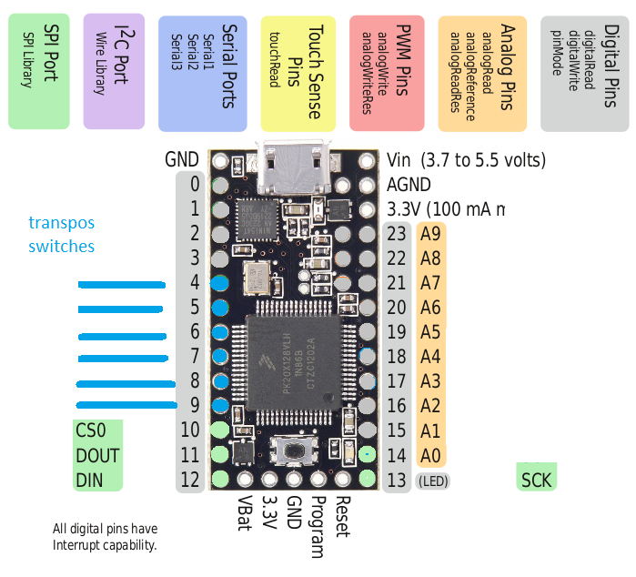
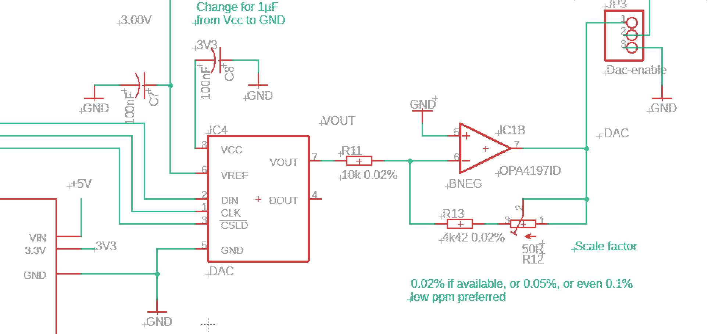
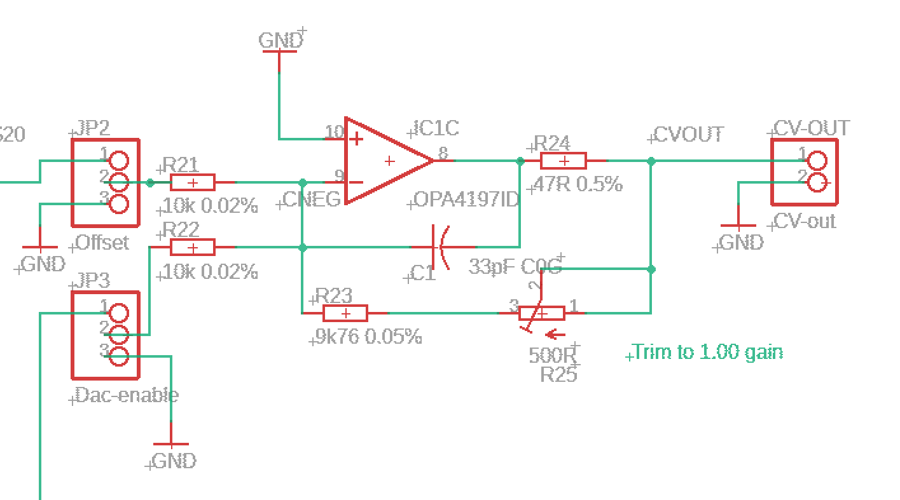
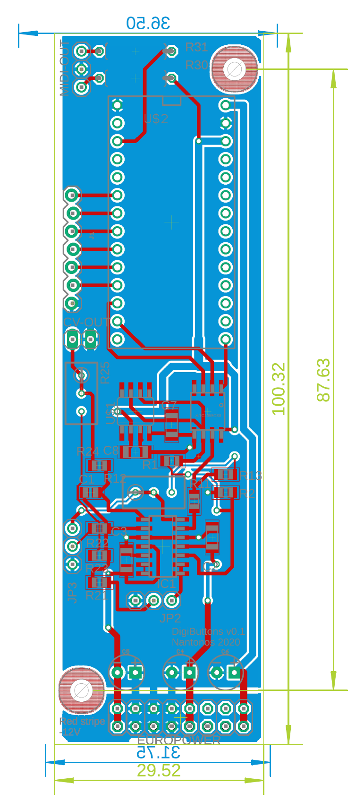

# Digital implementation of transpositeurs (pitch shift buttons)

Transpositeurs are a set of six buttons,
in the tiroir of an ondes Martenot,
placed to the right of the touche d'intensité,
which produce small shifts in pitch.
They may be pressed in combination to generate larger shifts.

|  button   |   tones  |  semitones   | millivolts (semitones /12)    | interval |
|--:  |--:  |--:  |--:  |--:  |
| 1    | -1/4    | -0.5    | -41.6666666666666667    | quarter-down |
| 2    | +1/4    | +0.5    | 41.6666666666666667    | quarter-up |
| 3    | +1/2    | +1    | 83.3333333333333333    | semitone |
| 4    | +1    | +2    |  166.666666666666667   | tone |
| 5    | +2    | +4    |  333.333333333333333   | third |
| 6    | +3 1/2    | +7    |  583.333333333333333   | fifth |
| 2to6 | | 14.5 | 1208.33333333333 | |

My initial design attempts were purely analog. However,
analog buttons circuit is basically a DAC, so try designing as a DAC.

Since this is MCU based
and it only adds a couple of resistors and a connector,
an optional MIDI out is provided.

## Component selection

### MCU

A Teensy LC is ample for this simple circuit.

Make as an SPI board with 5V input (for vref, needs 1mA) and Euro ±12V (for op-amps).
Power DAC with 3V3 from Teensy? Or add on-board regulator for 3V3?
DAC needs 270(typ) 550(max) μA so power from Teensy 3V3 seems totally fine.

Teensy SPI for DAC on 10 (cs), 11 (Dout MOSI) 13 (SCLK)
free pins - maybe LEDs for buttons?

buttons not matrixed, hardware debounce, trigger interrupts.
transp. buttons need 6 inputs: 4,5,6,7,8,9

* try with bounce lib, or use hw debounce.
debounce uses hex schmitt trigger, need 3: one for this, two for waveswitch)
	3rd has 4 unused - wire up anyway for other switches like clav/bague.
	one PCB, OSH park makes 3 anyway.

breadboard debounce circuit, test debounced switch to interrupt ISR.
breadboard analog post-DAC circuit using Teensy LC pin14 DAC just for testing.

Could also have MIDI out on pin 1 TX1. Just send pitchbend.

### DAC

Total swing = 29 demi-semitones. Use DAC with total swing of n*32 so each
demisemitone is n integral steps, and avoid dac codes at the ends to
eliminate zero offset and max offset errors.

Aim is better than 1 cent accuracy = 1/50n so if n > 2^6 = 1/64n, for 1 lsb INL

Thus only needs a 12bit DAC (with very good <1.0 INL and DNL, n = 2^7 = 128) or
14bit with <4 INL, DNL, n = 2^9 = 512
16bit with <16INL, DNL

**LTC1658CS8** 14bit SPI SOIC-8 [got, ordered 13 Sep 2014]
SOIC-8, 3V3 or 5V operation
DNL ±1.0 LSB max, DNL graph shows ±0.2 LSB typ
INL ±8.0 LSB max (more than 0.1V from rails), but INL graph shows typ +1, -2LSB
DNL, INL assume Vref < Vcc -0.1V so use 3V ref and 3V3 rail.
zero error 4mV over temperature -40 to +85°C = DAC count 21.8 so avoid counts 0 to 22
offset error ±4.0 mV max over temperature -40 to +85°C so avoid counts 16,361 to 16,383
Offset Error Temperature Coefficient ±5 μV/°C
Gain error ±20 LSB
Gain Error Drift ±2.5 ppm/°C
Vref input resistance 30k min, so current = 100μA.
$6.05 from Linear, singly, min order 2; have both MSOP and DIP8
$10.27 from Mouser, moq 1

1LSB = 3 ÷ 2^14 = 183μV at DAC out, 1 cent is 833μV so 4.5LSB per cent.
but less than this as the DAC output is scaled down to total swing.

### Vref

DAC needs external vref, preferably a bit lower than Vcc so 3.0V would be good.
AD780 or, better and cheaper, MAX6126-3

**AD780BNZ**  1mv initial accuracy 3ppm/°C PDIP [got]
needs 1μF from VCC to GND
[ to lower noise, add 100nF from pin3 to GND and 100μF from 3V ref output to GND
(fig.9 in datasheet)
normal noise is 1.2ppm = 3.6μV so not worth it ]

**LT6658AIDE-3** 0.5mV initial accuracy 10ppm/°C  SOIC-8
Temp drift essentially flat from 20 to 40°C (fig.11)

**MAX6126A30+** 0.5mV initial accuracy, 3ppm/°C SOIC-8
0.1μF to 10μF (best: 10μF // 0.1μF) output cap close to DAC Ref input.
0.1μF input cap and optional 0.1μF noise cap.

### Op-amps

Op-amps, use a quad SOIC-14.

OPA4172ID ±200μV (typ) ±1mV (max @ 25°C) ±1.15mV (max over 40°C to +125°C) offset. 240millicent (typ) 1.3cent (max over temp). **$2.84/10**

OPA4197ID  ±25μV (typ) ±100μV (max @ 25°C)  120millicent (max @ 25°C ) **$3.39/10** (IDR version)

### Resistors

### Misc

DAC needs 1μF from Vcc to GND. Op amps need usual 100n from +12V and -12V to GND.

## Full scale swing

Most negative value (1 pressed) -0.5/12 = -41.6666666666666667
Most positive value (2,3,4,5,6 all pressed)
583.333333333333333 + 333.333333333333333 + 166.666666666666667 + 83.3333333333333333 + 41.6666666666666667
= 1,208.33333333333333

Total swing 1,208.33333333333 + 41.6666666666667 = 1.250V.

Make DAC with around convenient unipolar swing, trim offset
to get negative 0.5semi lowest (ie trim for zero volts when sending code
for no buttons pressed), trim gain to get exact value when all buttons pressed.

### Values at all button combinations

Values in demi-semitones (multiples of 50 cents) where n=512 for 14-bit DAC.
Voltages at code 0 and code 2^14-1 approximate due to zero and fs error terms.
Do not measure at these code points.

Values below are _before_ the DAC scaling.

| buttons    |  dstones   |  code   | (code * 512)    |  V before offset   |  (V - offs)  | scaled (V-offs)
|:--  |--: |--:  |--:  |--:  |--:   |
| unused    |     | 0    |     | 0V    | ~-187.51mV    | around -83mV
| 1    |  -1   | 1n    | 512    | 93.75mV    | -93.75mV    | 41.6667mV
| none    | 0    | 2n    | 1024    | 187.51mV    | 0V    | 0V |
| 2    |  1   | 3n    |   1536  |     |     |
| 3    |  2   | 4n    |     |     |     |
| 2+3, 4+1   | 3    | 5n    |     |     |     |
| 4    |  4   | 6n    |     |     |     |
| 4+2    | 5    | 7n    |     |     |     |
| 4+3    | 6    | 8n    |     |     |     |
| 5+1    | 7    | 9n    |     |     |     |
| 5    | 8    | 10n    |     |     |     |
| 5+2    | 9    | 11n    |     |     |     |
| 5+3    | 10    | 12n    |     |     |     |
| 5+3+2    | 11    | 13n    |     |     |     |
| 5+4    | 12    | 14n    |     |     |     |
| 5+4+2, 6+1    | 13    |  15n   |     |     |     |
| 6, 5+4+3  | 14    | 16n    |     |     |     |
| 6+2, 5+4+3+2 | 15    |  17n   |     |     |     |
| 6+3    | 16    | 18n    |     |     |     |
| 6+3+2    | 17    |  19n   |     |     |     |
| 6+4    | 18    | 20n    |     |     |     |
| 6+4+2    | 19    | 21n    |     |     |     |
| 6+4+3    | 20    | 22n    |     |     |     |
| 6+5+1    | 21    | 23n    |     |     |     |
| 6+5    | 22    | 24n    |     |     |     |
| 6+5+2    | 23    |  25n   |     |     |     |
| 6+5+3    | 24    | 26n    |     |     |     |
| 6+5+4+1    | 25    | 27n    |     |     |     |
| 6+5+4    | 26    | 28n    |     |     |     |
| 6+5+4+3+1    | 27    | 29n    |     |     |     |
| 6+5+4+3    | 28    | 30n    |     |     |     |
| 6+5+4+3+2    | 29    | 31n    | 15872    | 2.90642V    | 2.7189159V    |
| unused    | 30    | 32n-1    | 16383    | 3.000V    | ~2.81249V    |

### Dac scale factor

Swing for 3V FS is (31n -1n) = (2.90625 - 0.09375) = 2.8125
Scale factor is  1.25 / 2.8125 = 0.44444444444444
So with an input resistor of 10k the feedback resistor is 4k444
closest E96 4k42 which is 24R low. So a 50R trimmer?

 1LSB = ( 3 * 0.444444444 ) / ( 2^14 ) = 8.13802082519531E-5
 = 81μV at op-amp out
 = 8.13802082519531E-5 * 1,200 = 97.65 millicents

tolerances:
Susumu RG2012V-103-P-T1 10k 0.02% 5ppm $2.60/25
- error on 10k is 2R
- error on 4k42 is 0.8R (!)
MAX6126-3 has initial accuracy ±0.5mV

31n expected value from table above is 2.90642V before mixing in the offset.
3.000 * 15872 / 16383 * 4444/10000
= 1.29161633400476

worst case high (Vref high, resistor tolerances tip to high, gain error +20LSB so 15872 is like 15892)
31n is 3.0005 * (15892 / 16383) * (4420.8 + 24 / 9998)
= 3.0005 * (15,892 / 16,383) * ((4,420.8 + 24) / 9,998)
= 1.29395105158369
2.335mV high

worst case low (Vref low, resistors to low, gain error -20LSB so 15872 is like 15852)
31n is 2.9995 * (15852/16,383) * ((4,419.2 + 24) / 10002)
= 1.28928375587655
-2.333mV low

same but now setting 50R trimmer to 0, to compensate
3.0005 * (15,892 / 16,383) * ((4,420.8) / 9,998)
= 1.28696427484728
= 4.652mv low, so easily covers the required adjustment

same but now setting 50R trimmer to 50, to compensate
2.9995 * (15852/16,383) * ((4,419.2 + 50) / 10002)
= 1.2968281782867
= 5.212mV high

### Negative voltage offset

Offset is 3 * 1,024 / 16,383 = 0.18751144479033
Before scaling, 187.5mV to take 'none' to 0V
with 3V ref, voltage divider 10 / 0.18751144479033 * 3 = 159.990234375 so 150k to 10k
E96 values 150k
BUT
After DAC scaling, 2n is 3.000 * 1024 / 16383 * 4444/10000
= 83.330mV
divider is 35k700 to 1020

tolerances:
Susumu RG2012V-103-P-T1 10k 0.02% 5ppm $2.60/25 error on 1k020 is 0.2R
and (for values > 10k) Susumu RG2012N-104-W-T1 100k 0.05%  10ppm $0.753/25 error on 35k700 is 18R
MAX6126-3 has initial accuracy ±0.5mV

worst case high: 3.0005 * 1020.2 / (35682 + 1020.2)
= 83.404mV 70μV high (85 millicents)

worst case low: 2.9995 * 1019.8 / ( 35718 + 1019.8)
= 83.263mV 70μV low (85 millicents)

These tiny errors do not merit a trimmer;
the increased tempco of the trimmer plus end stop resistance variability outweighs any advantage.

However, these E96 values are not readily available at those tolerances
so redo calculations with 0.1%:

Error on 1k020 is 1.02R; error on 35k700 is 35.7R (!!)

worst case high: 3.0005 * 1021 /(35664 + 1021)
= 0.08350853209759
= 178μV high (214 millicents)

worst case low: 2.9995 * 1019 / (35736 + 1019)
= 0.0831584954428
= 172μV low (206 millicents)

unity gain buffer not subject to resistor tolerances
further effect from input resistor to mixer, trimmed at mixer stage.
(use jumpers to alow trimming of offset and dac voltage separately).
That trim will also affect the DAC output,
but DAC scaling has its own trimmer and can also be adjusted digitally.

### Output (second inverting mixer stage to restore polarity)

Use innie 47r and 33pF C0G cap for cv inverter topology. [got 47R 0.1% and 33pF]
trim for gain 1.0 with offset jumpered to 0V.
If that trim shifts the offset, correct 0V code digitally to compensate CV out.

Both inputs to the mixer via 3-way pin connector, can be jumpered to 0V (for trimming) or
actual voltage.

Option: Use Hinton balanced output impedance circuit, Bantam TT.

### MIDI out

Button status expressed as MIDI 14bit pitchbend, output over DIN current loop with 3V3 resistor values
using circuit from (CA-033) MIDI 1.0 Electrical Specification Update [2014].

## PCB

Ordered OSH Park 2 May 2020 [OSH Park](https://oshpark.com/shared_projects/Cj8NEUIK)

### Top

### Bottom

- [Eagle brd](digibuttons.brd) |  [PDF board layout](board.pdf)
- [Eagle sch](digibuttons.sch) | [PDF schematic](schematic.pdf)

## Panel

Switch has circular, 12.7mm -0+0.2mm diameter mounting hole - say 12.8, so inner radius 6.4
Outer radius 7.40mm see [hexagon calculations](https://calcresource.com/geom-hexagon.html)

Top bezel is 14.0mm diameter.

## Testing results

* No power shorts
* Initial PCB error, wrong europower pin for +5V. Fixed with bodge wire.
* +12 -12 +5 seem ok (after bodge; before, 0mA on 5V)
* Current draw 17ma 5V, 2mA 12V, 8ma -12V
* Teensy displays blink OK so getting power, programmable
* Vref outputs 2.999930V initially (error 70μV or 23ppm). Slight climb as it warms up over 10 minutes.
* DAC test program, output does vary.
* jumper for Voffs goes to -11.8V implying an unterminated feedback loop so op-amp climbs near rail.
* Fixed! Connection for feedback went to wrong side of input resistor. Bodge wire and track cut.
*  83mV offset measures okay
* wish there were more stable measurement points, like single pins rather than chip pins or test points.

### Measurements

ondes_DAC_explorer_01

const uint16_t dacval[vals] = {0, lowest, zeropoint, six, maxpins, 16383};

Jumper for DAC output, offset jumpered to zero.
Do not use zero or max values to calculate overall gain, due to
zero and FS errors.

Example: 2.99993 * 512 / 16,383 = 0.09375353476164 * 0.4444 = 41.664mV

| DAC code | expected voltage | measured voltage | error, ppm | error, cent |
|:--       |:--               |:--               |:--         |:--          |
| 0        | 0                | 31.2 mV ?? check | ---        |             |
| 512      | 41.664 mV        | 41.768 mV        | +2496 ppm  | 0.1248      |
| 1024     | 83.328 mV        | 83.501 mV        | +2076 ppm  | 0.2076      |
| 8192     | 666.625 mV       | 666.762 mV       | +205 ppm   | 0.1644      |
| 15872    | 1.291668 V       | 1.29179 V        | +94.4 ppm  | 0.1464      |
| 16383    | 1.333169 V       | 1.33338 V        | ---        |             |

ondes_DAC_explorer_02

constant output of maxpins DAC count 15872 = 1.291668 V), for trimming with DAC gain trimmer.

* Desired value = 1.291616V.
* Initial value =  1.291785V.
* After trimming = 1.291619V

ondes_DAC_explorer_03

constant output of zeropoint DAC count 1024 = 83.337777 mV), for nulling with DAC gain trimmer.
Jumpers for both DAC and offset.

Nulled to 9.8 μV σ 8.8μV.

ondes_DAC_explorer_02

Same program, Jumpers for both DAC and offset.
Now leave DAC gain alone, to retain zero; adjust maxpins to exactly 1.208333 V

### Next steps

* Measure Vref output
* Re-measure the previous tests, to check (and re-familiarize after the break)
* start on front panel design

Need to decide if standard Eurorack, or modified tiroir-skiff with back panel for outputs.